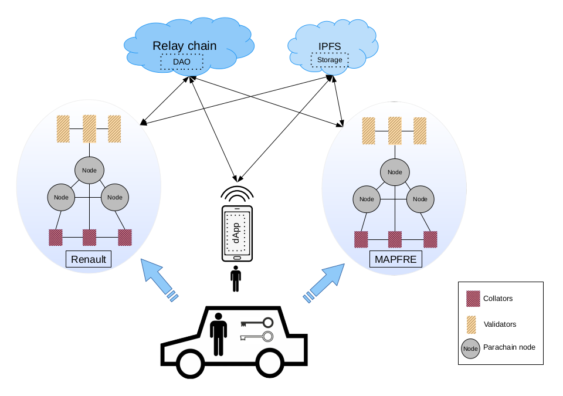

# README #

This repo aims to demonstrate and test Substrate based blockchain interoperability using a relay chain and two parachain.

### What is this repository for? ###

* Demonstrate and test Substrate based blockchain interoperability
* Version 0.1



Current state of implementation:

- [x] 1 Relay chain (polkadot)
- [x] 2 Parachains ([Renault](git@bitbucket.org:edge-team-leat/substrate-blockchain-parachain-renault.git) & [MAPFRE](git@bitbucket.org:edge-team-leat/substrate-blockchain-parachain-mapfre.git))
- [x] Auto parachain add on relay chain using the [Polkadot JS library](https://github.com/polkadot-js/api) (help [here](https://github.com/paritytech/polkadot-launch/blob/master/src/rpc.ts))
- [x] Add [SIM pallet](https://github.com/lucgerrits/substrate-node-template/tree/sim-project/pallets/sim) on Renault parachain
- [ ] Create Renault centralized database connected to its parachain to manage access (i.e. create new pallet or modify existing to manage authentification)
  * IPFS ?
  * It authentification with [Zero-Knowledge](https://en.wikipedia.org/wiki/Zero-knowledge_proof)/[zk-SNARK](https://en.wikipedia.org/wiki/Non-interactive_zero-knowledge_proof) possible ? (help zk-SNARK)
  * Use basic permission system (add/remove account IDs from list)?
- [ ] Send crash transactions to the parachain using a script or IoT (Raspberry Pi). Use a [JS script like previously](https://bitbucket.org/edge-team-leat/sim-tas-group-tests/src/main/Substrate/substrate-transaction-js/) or the tutorship new version.
- [x] Create the MAPFRE parachain: template parachain with a pallet that can manage an insurance situation (to define)
- [ ] Send [XCM](https://wiki.polkadot.network/docs/learn-crosschain) in between two parachains


### How do I get set up? ###

#### Summary of set up ####

There are lots of things to setup, build and execute before having a functional multichain environement.

1. Configure your machine
2. Build the parachains and relay chain
3. Setup/verify the docker/kubernetes .YAML files
4. Start the relay chain
5. Start the parachains

> "You should have at least two validators (relay chain nodes) running for every collator" -[https://docs.substrate.io/](https://docs.substrate.io/tutorials/v3/cumulus/connect-parachain#connecting-additional-parachain-nodes)

6. **Use the Polkadot.js interface** to manage the setup: [polkadot.js.org](https://polkadot.js.org/apps/?rpc=ws%3A%2F%2F127.0.0.1%3A9944#/explorer)


#### Dependencies ####

* Git
* Curl
* Rust
* gnome-terminal
* jq
* node / nodejs [install link](https://nodejs.org/en/download/package-manager/)


#### Local machine configuration ####

```bash
#set up your machine if not done
curl https://sh.rustup.rs -sSf | sh
source ~/.cargo/env

#Be sure to update everything
rustup default stable
rustup update

rustup update nightly
rustup target add wasm32-unknown-unknown --toolchain nightly

#test your config
rustc --version
rustup show
```

#### Startup scripts ####

* [pull_and_build.sh](./scripts/pull_and_build.sh) to pull the relay chain and parachains and puild it
* Run all-in-one task in vscode.
<!-- * [start_relay_chain.sh](./scripts/start_relay_chain.sh) to start the relay chain
* [start_parachains.sh](./scripts/start_relay_chain.sh) to start the relay chain -->

View chain status/explorer:

* [relay chain](https://polkadot.js.org/apps/?rpc=ws%3A%2F%2F127.0.0.1%3A9944#/explorer)
* [parachain renault](https://polkadot.js.org/apps/?rpc=ws%3A%2F%2F127.0.0.1%3A8844#/explorer)
* [parachain insurance](https://polkadot.js.org/apps/?rpc=ws%3A%2F%2F127.0.0.1%3A8843#/explorer)

#### How to run tests ####


#### Deployment instructions ####

### Who do I talk to? ###

* Repo owner or admin
* Other community or team contact